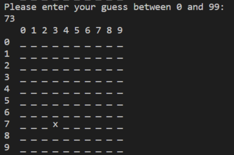

Welcome to Battleships! This is a turn-based tactical game where the objective is to sink your opponent's ships before they sink yours.

# How to Play

**1. Place your ships**.

You will need to place 6 ships in total.

The first ship is a length of 5

The second ship is a length of 4

The third and fourth ships are a length of 3

The fifth and sixth ships are a length of 2

If you place your ships incorrectly, an error message will display and you can try again.

**2. Take a shot** 

The Computer will build its board with the same amount of ships. You then get the first shot.

The board follows a grid from 0 to 99. To shoot, enter a number between 0 and 99 and the board will update with the outcome. For example, let's try shooting at 73

On the image above, the shot at 73 is a miss.

The characters for the actions are:

MISS = x

HIT = o

SINK = O

If you sink a ship, the last character will be 'O' to notify that you have sunk a ship.
___

# User Experience

**Target Audience**

The target audience for the game are strategy gamers who want to play a game of strategy with the added difficulty of the computer using logic to sink ships.

**User Stories**

1. As a novice to strategy games I want a clear description as to how to play the game. End user goal: Understand rules of game. End business goal: Keep users playing game. Acceptance criteria: Place clear print messages telling player to input value, Add clear info of rules in README.

2. As an experienced strategy gamer, I want to play a game where the opponent uses logic. End user goal: Play game of strategy against logic user. End business goal: Keep users playing game. Acceptance criteria: Add tactics function that tells computer to look at adjacent places to a ship once hit.

3. As a gamer, I want to place where I want my ships myself. End user goal: Place ships. End business goal: Keep users playing game. Acceptance criteria: Add create ships function letting user place own ships on board.

# Wireframes

I initially wanted to create a difficulty selection option of Easy and Hard. This would benefit user #1 (The Novice) who is a beginner to strategy games. In order to achieve an easy difficulty, I planned to remove the logic function so that the computer would guess at random, even if it hits a ship, it would continue at random.

I decided to remove the difficulty selection as the random feature defeats the purpose of a strategy game in my opinion.

# Features

**Build Your Ship Fleet**

**Clear Characters of Actions**

**Clear Character of Sunk Ship**

**Endgame Message**

# Testing

Whilst working on the code, I kept in mind to check for errors using Gitpod's Lint checker. Only two errors displaying that two lines of code are too long but I could not fix these errors without breaking the code.

The warnings come from the beggining logo print message, alerting of whitespace and invalid characters that have no effect on the code but are soley for aesthetic purposes.

**Updated** - 17th August: Line too long error fixed. No further errors found

[Pep8](http://pep8online.com/)

Pep8 found the same errors as Lint.

[ExtendsClass](https://extendsclass.com/python-tester.html)

ExtendsClass found no errors or warnings with the syntax of the code.

# Future Development

**Clearer Boards**

Overall, I'm pleased that the game works well. I would like to adjust both the boards so that they are clearer as it can be quite confusing which board is the player's and which is the computers.

**Clear Rules**

I feel that the rules and description of How to Play is quite short. However, adding to the rules could make the app too text heavy which could dismay users before they start the app.

# Technology used

The two websites below were very useful for learning materials. [Stack overflow](https://stackoverflow.com/) is a forum website where users post problems with their code and receive input from the community.

[thispointer.com](https://thispointer.com/)

[stackoverflow](https://stackoverflow.com/)

I copied the ascii art 'Battleships' from the website below. There was not an author attached to the art so I cannot give a full acknowledgement. The art copied became the logo for the game.

[Network Science](http://www.network-science.de/ascii/)

I created a separate git repository for the purpose of testing the random placing of the computer ships and testing the tactics that the computer uses before implementing the code into the main Battleship app. I did this to avoid having to enter inputs when testing my code. I realise that I could have commented out the inputs and functions but felt this way was easier.

[Test-ship-random](https://github.com/mattm1346/test-ship-random) 

**Youtube**

[Dr Codie](https://www.youtube.com/channel/UCFH0iZlolP0HiJOUuDxihqg)

Dr Codie's video tutorial helped with generating the tactics that the computer uses.

[Dylan Israel](https://www.youtube.com/channel/UC5Wi_NYysX-LfcqT3Hq9Faw)

[Dev Ed](https://www.youtube.com/channel/UClb90NQQcskPUGDIXsQEz5Q)

The two videos above were very helpful with refreshing what I've learnt about Python and providing more information with Python functions.

# Deployment

**GitHub**

The app has been deployed to GitHub and a link to the page can be found here: [Battleship - GitHub](https://github.com/mattm1346/Battleship)

**Heroku**

The app has been deployed to Heroku and a link to the page can be found here: [Battleship - Heroku](https://dashboard.heroku.com/apps/battleships-python)

A link to the app can be found here: [Battleship](https://battleships-python.herokuapp.com/)

